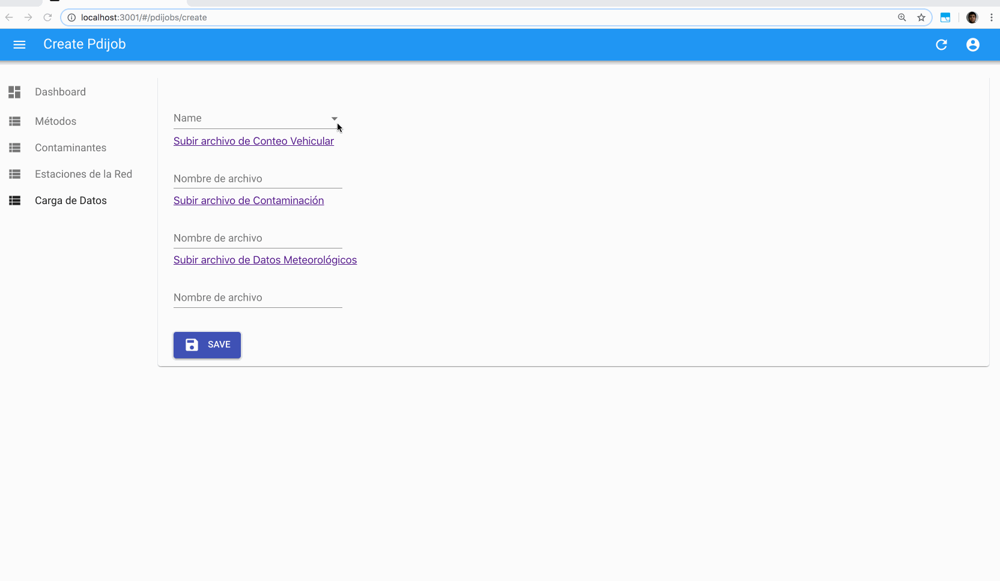

# Carga de Datos

Para iniciar la carga de datos fuentes, hay que realizar los siguientes pasos:

1. Presionar el botón para Subir archivo...
2. En la web para carga de archivos, es necesario realizar Drag&Drop del archivo deseado
3. Copiar el nombre del archivo
4. Pegar el nombre del archivo en el campo correspondiente del Backoffice

## Video

